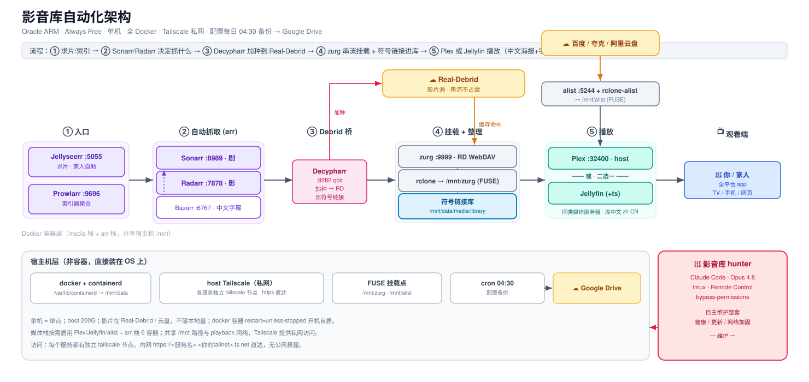

# media-stack-setup

A [Claude Code](https://docs.claude.com/en/docs/claude-code) **skill** + setup
guide for self-hosting a **streaming media library** on a single Linux box — where
the media never lives on local disk.

Real-Debrid holds the files; `zurg` + `rclone` stream them through a FUSE mount;
the *arr stack automates acquisition; Plex/Jellyfin serve playback with Chinese
metadata; everything is reachable privately over Tailscale (nothing on the public
internet); configs back up daily to Google Drive.



## The pipeline

```
求片/索引 → Sonarr/Radarr 决定抓什么 → Decypharr 加种到 Real-Debrid
  → zurg 串流挂载 /mnt/zurg → 符号链接进 library → Plex/Jellyfin 播放（中文海报+字幕）
```

- **media stack** — zurg (RD client) → rclone FUSE mount `/mnt/zurg`; optional alist for 百度/夸克/阿里云盘; Plex and/or Jellyfin.
- **arr stack** — Prowlarr, Sonarr, Radarr, Bazarr, Jellyseerr, and **Decypharr** (a qBittorrent-shim that bridges *arr to Real-Debrid and symlinks the cached files into the library).
- **access** — a Tailscale sidecar per service → `https://<svc>.<tailnet>.ts.net`.
- **safety net** — daily cron backup of all configs → Google Drive.

## What's here

| File | Purpose |
|------|---------|
| [`SKILL.md`](SKILL.md) | The skill entry point — prerequisites, 6-phase roadmap, operating principles |
| [`references/compose-media.yml`](references/compose-media.yml) | Media-stack docker-compose template + setup notes |
| [`references/compose-arr.yml`](references/compose-arr.yml) | arr automation docker-compose template |
| [`references/wiring.md`](references/wiring.md) | API wiring: Decypharr RD bridge, root folders, download clients, 中文化 |
| [`references/tailscale-sidecars.md`](references/tailscale-sidecars.md) | Private access via userspace sidecar + `serve` (keeps the arr mesh working) |
| [`references/troubleshooting.md`](references/troubleshooting.md) | Real-world gotchas (symlink path consistency, SELinux 203/EXEC, storage layout, …) |
| [`scripts/config-backup.sh`](scripts/config-backup.sh) | Daily config backup → Google Drive |
| [`media-arch.svg`](media-arch.svg) | The architecture diagram above |

## Use it as a Claude Code skill

Drop it into your skills directory and Claude will load it automatically:

```bash
git clone https://github.com/s546126/media-stack-setup.git \
  ~/.claude/skills/media-stack-setup
```

Then in Claude Code, just ask — e.g. *"帮我搭一套 Real-Debrid 影音库"* or
*"set up Sonarr/Radarr with Real-Debrid and Plex"* — and the skill triggers,
walking the setup phase by phase. Or read [`SKILL.md`](SKILL.md) directly as a
guide.

## Notes

- All tokens, keys, and IPs in the templates are **placeholders** (`<YOUR_…>`,
  `100.x.x.x`) — fill in your own; never commit real secrets.
- Built and battle-tested on an Oracle Always Free ARM instance, but works on any
  Linux host with Docker.

---

*Generated as a reusable skill from a real deployment. Not affiliated with
Real-Debrid, Plex, Jellyfin, or the *arr / zurg / Decypharr projects.*
